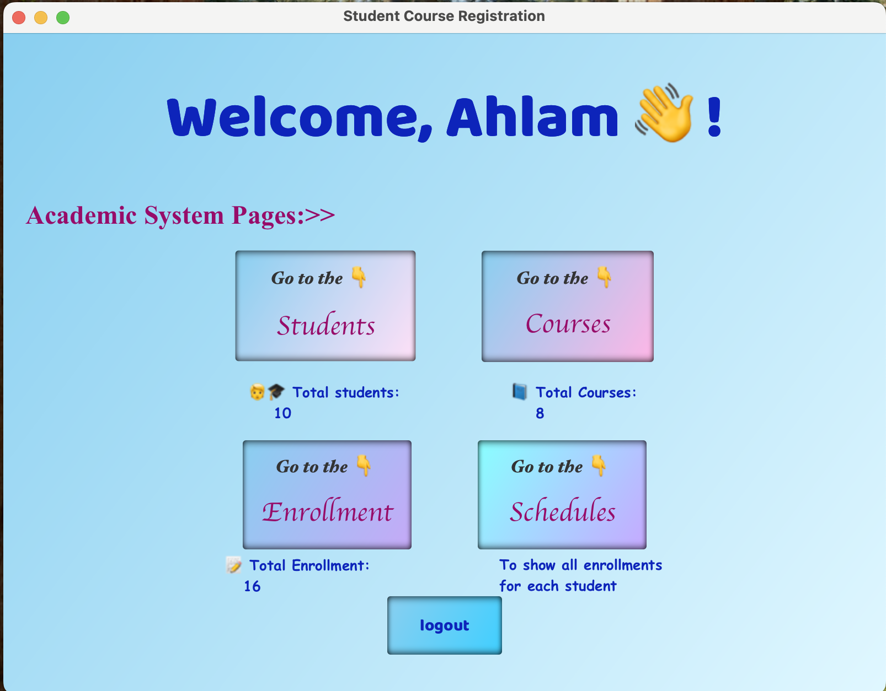

# 🎓 Student Course System

## 🧩 Project Overview
The **Student Course System** is a JavaFX-based desktop application designed to simplify course and student management.  
It allows administrators and students to interact with academic information easily — adding, viewing, and managing students, courses, and enrollments through a modern and user-friendly interface.

---

## 🌟 Features
- 👩‍🎓 **Student Management:** Add, edit, delete, and view student records.  
- 📚 **Course Management:** Create and manage course information with related details.  
- 📝 **Enrollment System:** Enroll students in courses, manage deadlines, and view schedules.  
- 📊 **Dashboard:** Displays summary statistics and quick access to all sections.  
- 🔒 **Login & Authentication:** Secure login for users before accessing the system.  
- 💾 **Database Integration:** All data is stored and managed using MySQL.  

---

## 🛠️ Technologies Used
- **JavaFX** — for building the graphical user interface.  
- **MySQL** — as the backend database.  
- **JDBC / JPA (Hibernate)** — for database connectivity and ORM.  
- **Maven** — for project management and dependency handling.  
- **CSS** — for interface styling.  

---
## 📸 Project Screenshots
## 🔒 Login Page:  

## 🔒 SignUp Page:

## Dashboard Page:

## 👩‍🎓 Students Page:

## 📚 Courses Page:

## 📝 Enrollment Page:

## 📊 Schedule Page:
